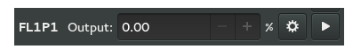

.. _config:

=============
Configuration
=============

A collection of user interface elements are available. Configuration refers here

to the XML code that defines the individual elements. Included in the collection

are the box and page and thus a layout is created by recursively packing elements

into boxes which are in turn packed into pages.

Analog Input Control
^^^^^^^^^^^^^^^^^^^^

 This control displays the current value along with statistical data.

 This section shows how to add ann analog input control to a configuration file.

.. code-block:: xml
   :linenos:

   <ui:object id="ai-ctl0" type="ai" ref="/daqctl0/dev0/ai00"/>

**Table of Configurable Attributes**

+-----------+---------------+
| attribute | default value |
+-----------+---------------+
| id        | ai-ctl0       |
+-----------+---------------+
| ref       | null          |
+-----------+---------------+

This class contains no configurable properties.

The Analog Input Control as it appears when added to the interface:

.. figure:: assets/ai-control.png

Analog Output Control
^^^^^^^^^^^^^^^^^^^^^

This control facilitates

.. code-block:: xml
   :linenos:

   <ui:object id="ao-ctl0" type="ao" ref="/daqctl0/dev0/ao00"/>

**Table of Configurable Attributes**

+-----------+---------------+
| attribute | default value |
+-----------+---------------+
| id        | ao-ctl0       |
+-----------+---------------+
| ref       | null          |
+-----------+---------------+

This class contains no configurable properties.

Box
^^^

This section shows how to add a box to a configuration file. A Dactl Box inherits

properties of a Gtk Box. It is simply a container for a user interface element

or another box.

.. code-block:: xml
   :linenos:

   <ui:object id="box0" type="box">
     <ui:property name="homogeneous">true</ui:property>
     <ui:property name="orientation">horizontal</ui:property>
     <ui:property name="expand">true</ui:property>
     <ui:property name="fill">true</ui:property>
     <ui:property name="spacing">0</ui:property>
     <ui:property name="margin-top">0</ui:property>
     <ui:property name="margin-right">0</ui:property>
     <ui:property name="margin-bottom">0</ui:property>
     <ui:property name="margin-left">0</ui:property>
     <ui:property name="hexpand">true</ui:property>
     <ui:property name="vexpand">true</ui:property>
     <!--
        - Can contain <ui:object> elements of type:
        -
        -  * "ai":         Dactl.AIControl
        -  * "ao":         Dactl.AOControl
        -  * "box":        Dactl.Box
        -  * "tree":       Dactl.ChannelTreeView
        -  * "chart":      Dactl.Chart
        -  * "stripchart": Dactl.StripChart
        -  * "rt-chart":   Dactl.RTChart
        -  * "polarchart": Dactl.PolarChart
        -  * "pnid":       Dactl.Pnid
        -  * "pid":        Dactl.PidControl
        -  * "exec":       Dactl.ExecControl
        -  * "log":        Dactl.LogControl
        -  * "video":      Dactl.VideoProcessor
        -->
   </ui:object>

**Table of Configurable Attributes**

+-----------+---------------+
| attribute | default value |
+-----------+---------------+
| id        | null          |
+-----------+---------------+
| name      | null          |
+-----------+---------------+

**Table of Configurable Properties**

+---------------+-----------+---------------+
| property      | data type | default value |
+---------------+-----------+---------------+
| homogeneous   | bool      | null          |
+---------------+-----------+---------------+
| orientation   | string    | null          |
+---------------+-----------+---------------+
| expand        | bool      | null          |
+---------------+-----------+---------------+
| fill          | bool      | null          |
+---------------+-----------+---------------+
| spacing       | int       | null          |
+---------------+-----------+---------------+
| margin-top    | int       | null          |
+---------------+-----------+---------------+
| margin-right  | int       | null          |
+---------------+-----------+---------------+
| margin-bottom | int       | null          |
+---------------+-----------+---------------+
| margin-left   | int       | null          |
+---------------+-----------+---------------+
| hexpand       | bool      | null          |
+---------------+-----------+---------------+
| vexpand       | bool      | null          |
+---------------+-----------+---------------+

Channel Treeview
^^^^^^^^^^^^^^^^

This section shows how to add a channel treeview to a configuration file. The
columns of the treeview will appear in the same order as the configuration file.
Channels can be put in to groups that can expand or collapse when the category
name is activated.

.. code-block:: xml
   :linenos:

   <ui:object id="tree0" type="tree">
     <ui:property name="width-request">width-re</ui:property>
     <ui:property name="show-header">true</ui:property>
     <ui:property name="expand">true</ui:property>
     <ui:property name="fill">true</ui:property>
     <ui:property name="show-tag">true</ui:property>
     <ui:property name="show-desc">true</ui:property>
     <ui:property name="show-sample-sdev">true</ui:property>
     <ui:property name="show-sample-size">true</ui:property>
     <ui:property name="show-units">true</ui:property>
     <!--
        - Can contain <ui:object> elements of type:
        -
        -  * "tree-category": Dactl.ChannelTreeCategory
        -  * "tree-entry":    Dactl.ChannelTreeEntry
        -->
   </ui:object>

**Table of Configurable Attributes**

+-----------+---------------+
| attribute | default value |
+-----------+---------------+
| id        | null          |
+-----------+---------------+
| chref     | null          |
+-----------+---------------+

**Table of Configurable Properties**

+------------------+-----------+---------------+
| property         | data type | default value |
+------------------+-----------+---------------+
| width-request    | int       | null          |
+------------------+-----------+---------------+
| show-header      | bool      | null          |
+------------------+-----------+---------------+
| expand           | bool      | null          |
+------------------+-----------+---------------+
| fill             | bool      | null          |
+------------------+-----------+---------------+
| show-tag         | bool      | null          |
+------------------+-----------+---------------+
| show-desc        | bool      | null          |
+------------------+-----------+---------------+
| show-sample-sdev | bool      | null          |
+------------------+-----------+---------------+
| show-sample-size | bool      | null          |
+------------------+-----------+---------------+
| show-units       | bool      | null          |
+------------------+-----------+---------------+

The Channel Treeview Control as it appears when added to the interface:

Channel Tree Entry
^^^^^^^^^^^^^^^^^^

This section shows how to add a channel tree entry to a configuration file.

.. code-block:: xml
   :linenos:

   <ui:object id="entry0" type="tree-entry" chref="/daqctl0/dev0/ai00"/>

**Table of Configurable Attributes**

+-----------+---------------+
| attribute | default value |
+-----------+---------------+
| id        | null          |
+-----------+---------------+
| chref     | null          |
+-----------+---------------+

Channel Tree Category
^^^^^^^^^^^^^^^^^^^^^

This section shows how to add a channel tree category to a configuration file.

.. code-block:: xml
   :linenos:

   <ui:object id="cat0" type="tree-category"/>
     <ui:property name="title">Title</ui:property>
     <!--
        - Can contain <ui:object> elements of type:
        -
        -  * "tree-category": Dactl.ChannelTreeCategory
        -  * "tree-entry":    Dactl.ChannelTreeEntry
        -->
   </ui:object>

**Table of Configurable Attributes**

+-----------+---------------+
| attribute | default value |
+-----------+---------------+
| id        | null          |
+-----------+---------------+

**Table of Configurable Properties**

+------------------+-----------+---------------+
| property         | data type | default value |
+------------------+-----------+---------------+
| title            | string    | null          |
+------------------+-----------+---------------+

Command Execution Control
^^^^^^^^^^^^^^^^^^^^^^^^^

This section shows how to add a control that executes the given command to a configuration file.

.. code-block:: xml
   :linenos:

   <ui:object id="exec-ctl0" type="exec"/>

**Table of Configurable Attributes**

+-----------+---------------+
| attribute | default value |
+-----------+---------------+
| id        | null          |
+-----------+---------------+

This class contains no configurable properties.

Log Control
^^^^^^^^^^^

This section shows how to add a log control to a configuration file.

.. code-block:: xml
   :linenos:

   <ui:object id="log-ctl0" type="log" ref="/logctl0/log0"/>

**Table of Configurable Attributes**

+-----------+---------------+
| attribute | default value |
+-----------+---------------+
| id        | null          |
+-----------+---------------+
| ref       | null          |
+-----------+---------------+

This class contains no configurable properties.

The Log Control as it appears when added to the interface:

.. figure:: assets/log-control.png

Page
^^^^

This section shows how to add a page to a configuration file.

.. code-block:: xml
   :linenos:

   <ui:object id="pg0" type="page">
     <ui:property name="index">0</ui:property>
     <ui:property name="title">Title</ui:property>
     <ui:property name="expand">true</ui:property>
     <ui:property name="fill">true</ui:property>
     <ui:property name="visible">true</ui:property>
     <!--
        - Can contain <ui:object> elements of type:
        -
        -  * "box":  Dactl.Box
        -->
   </ui:object>

**Table of Configurable Attributes**

+-----------+---------------+
| attribute | default value |
+-----------+---------------+
| id        | null          |
+-----------+---------------+

**Table of Configurable Properties**

+-------------------+---------------------+---------------+
| property          | data type           | default value |
+-------------------+---------------------+---------------+
| index             | int                 | null          |
+-------------------+---------------------+---------------+
| title             | string              | null          |
+-------------------+---------------------+---------------+
| expand            | bool                | null          |
+-------------------+---------------------+---------------+
| fill              | bool                | null          |
+-------------------+---------------------+---------------+
| visible           | bool                | null          |
+-------------------+---------------------+---------------+

PID Control
^^^^^^^^^^^

This section shows how to add a pid control to a configurtion file.

.. code-block:: xml
   :linenos:

   <ui:object id="pid-ctl0" type="pid" ref="/atmctl0/pid0"/>

**Table of Configurable Attributes**

+-----------+---------------+
| attribute | default value |
+-----------+---------------+
| id        | null          |
+-----------+---------------+
| ref       | null          |
+-----------+---------------+

This class contains no configurable properties.

The PID Control as it appears when added to the interface:

Plugin Control
^^^^^^^^^^^^^^

This section shows how to add a plugin control to a configuration file.

.. code-block:: xml
   :linenos:

   <ui:object id="plugin-ctl0" type="plugin-control" parent="box0">
     <!-- Can contain references to the CLD tree, eg. -->
     <ui:property name="ref">/daqctl/dev0/ao00</ui:property>
   </ui:object>

**Table of Configurable Attributes**

+-----------+---------------+
| attribute | default value |
+-----------+---------------+
| null      | null          |
+-----------+---------------+

**Table of Configurable Properties**

+-------------------+---------------------+---------------+
| property          | data type           | default value |
+-------------------+---------------------+---------------+
| ref               | string              | null          |
+-------------------+---------------------+---------------+

PNID Control
^^^^^^^^^^^^

This section shows how to add a pnid to a configuration file.

.. code-block:: xml
   :linenos:

   <ui:object id="pnid0" type="pnid">
     <ui:property name="image-file">image-file.svg</ui:property>
     <ui:property name="expand">true</ui:property>
     <ui:property name="fill">true</ui:property>
     <ui:property name="timeout">1000</ui:property>
     <!--
        - Can contain <ui:object> elements of type:
        -
        -  * "pnid-text": Dactl.PnidElement
        -->
   </ui:object>

**Table of Configurable Attributes**

+-----------+---------------+
| attribute | default value |
+-----------+---------------+
| id        | null          |
+-----------+---------------+

**Table of Configurable Properties**

+-------------------+---------------------+---------------+
| property          | data type           | default value |
+-------------------+---------------------+---------------+
| image-file        | string              | null          |
+-------------------+---------------------+---------------+
| expand            | bool                | null          |
+-------------------+---------------------+---------------+
| fill              | bool                | null          |
+-------------------+---------------------+---------------+
| timeout           | int                 | null          |
+-------------------+---------------------+---------------+

PnidElement
^^^^^^^^^^^

This section shows how to add a PNID to a configuration file.

.. code-block:: xml
   :linenos:

   <ui:object id="element0" type="element">
     <ui:property name="cld-ref">cld-ref</ui:property>
     <ui:property name="svg-ref">svg-ref</ui:property>
   </ui:object>

**Table of Configurable Attributes**

+-----------+---------------+
| attribute | default value |
+-----------+---------------+
| id        | null          |
+-----------+---------------+
| cld-ref   | null          |
+-----------+---------------+
| svg-ref   | null          |
+-----------+---------------+

**Table of Configurable Properties**

+-------------------+---------------------+---------------+
| property          | data type           | default value |
+-------------------+---------------------+---------------+
| cld-ref           | string              | null          |
+-------------------+---------------------+---------------+
| svg-ref           | string              | null          |
+-------------------+---------------------+---------------+

Chart
^^^^^

This secion shows how to add a chart to a configuration file.

.. code-block:: xml
   :linenos:

   <ui:object id="chart0" type="chart">
     <ui:property name="title">Title</ui:property>
     <ui:property name="expand">true</ui:property>
     <ui:property name="fill">true</ui:property>
     <ui:property name="height-min">0</ui:property>
     <ui:property name="weight-min">0</ui:property>
     <ui:property name="show-title">true</ui:property>
     <ui:property name="show-grid">true</ui:property>
     <ui:property name="show-grid-border">true</ui:property>
     <!--
        - Can contain <ui:object> elements of type:
        -
        -  * "chart-axis": Dactl.Axis
        -->
   </ui:object>

**Table of Configurable Attributes**

+-----------+---------------+
| attribute | default value |
+-----------+---------------+
| id        | null          |
+-----------+---------------+

**Table of Configurable Properties**

+-------------------+---------------------+---------------+
| property          | data type           | default value |
+-------------------+---------------------+---------------+
| title             | string              | null          |
+-------------------+---------------------+---------------+
| expand            | bool                | null          |
+-------------------+---------------------+---------------+
| fill              | bool                | null          |
+-------------------+---------------------+---------------+
| height-min        | int                 | null          |
+-------------------+---------------------+---------------+
| width-min         | int                 | null          |
+-------------------+---------------------+---------------+
| show-title        | bool                | null          |
+-------------------+---------------------+---------------+
| show-grid         | bool                | null          |
+-------------------+---------------------+---------------+
| show-grid-border  | bool                | null          |
+-------------------+---------------------+---------------+

Chart Axis
^^^^^^^^^^

This section shows how to add a chart axis to a configuration file.

.. code-block:: xml
   :linenos:

   <ui:object id="ax0" type="chart-axis">
     <ui:property name="label">true</ui:property>
     <ui:property name="orientation">horizontal</ui:property>
     <ui:property name="min">true</ui:property>
     <ui:property name="max">true</ui:property>
     <ui:property name="div-major">0</ui:property>
     <ui:property name="div-minor">0</ui:property>
     <ui:property name="show-label">true</ui:property>
     <ui:property name="show-minor-ticks">true</ui:property>
     <ui:property name="show-major-ticks">true</ui:property>
     <ui:property name="show-minor-labels">true</ui:property>
     <ui:property name="show-major-labels">true</ui:property>
     <ui:property name="show-start-label">true</ui:property>
     <ui:property name="show-end-label">true</ui:property>
     <ui:property name="rotate-label">true</ui:property>
   </ui:object>

**Table of Configurable Attributes**

+-----------+---------------+
| attribute | default value |
+-----------+---------------+
| id        | null          |
+-----------+---------------+

**Table of Configurable Properties**

+-------------------+-----------+---------------+
| property          | data type | default value |
+-------------------+-----------+---------------+
| label             | bool      | null          |
+-------------------+-----------+---------------+
| orientation       | string    | null          |
+-------------------+-----------+---------------+
| min               | bool      | null          |
+-------------------+-----------+---------------+
| max               | bool      | null          |
+-------------------+-----------+---------------+
| div-major         | int       | null          |
+-------------------+-----------+---------------+
| div-minor         | int       | null          |
+-------------------+-----------+---------------+
| show-labe         | bool      | null          |
+-------------------+-----------+---------------+
| show-minor-ticks  | bool      | null          |
+-------------------+-----------+---------------+
| show-major-ticks  | bool      | null          |
+-------------------+-----------+---------------+
| show-minor-labels | bool      | null          |
+-------------------+-----------+---------------+
| show-major-labels | bool      | null          |
+-------------------+-----------+---------------+
| show-start-label  | bool      | null          |
+-------------------+-----------+---------------+
| show-end-label    | bool      | null          |
+-------------------+-----------+---------------+
| rotate-label      | bool      | null          |
+-------------------+-----------+---------------+

Real Time Chart
^^^^^^^^^^^^^^

This secion shows how to add a real time chart to a configuration file.

.. code-block:: xml
   :linenos:

   <ui:object id="chart2" type="rt-chart">
     <ui:property name="title">Speed</ui:property>
     <ui:property name="height-min">100</ui:property>
     <ui:property name="width-min">100</ui:property>
     <ui:property name="refresh-ms">33</ui:property>
     <ui:property name="show-grid">true</ui:property>
     <ui:property name="show-grid-border">true</ui:property>
     <ui:property name="show-title">true</ui:property>
     <ui:property name="reverse-x-axis">false</ui:property>
     <ui:property name="show-x-axis-label">true</ui:property>
     <ui:property name="rotate-x-axis-label">false</ui:property>
     <ui:property name="show-y-axis-label">true</ui:property>
     <ui:property name="rotate-y-axis-label">true</ui:property>
     <!--
        - Can contain <ui:object> elements of type:
        -
        -  * "chart-axis":  Dactl.Axis
        -  * "rt-chart-trace": Dactl.Trace
        -->
   </ui:object>

**Table of Configurable Attributes**

+-----------+---------------+
| attribute | default value |
+-----------+---------------+
| id        | null          |
+-----------+---------------+

**Table of Configurable Properties**

+-------------------+---------------------+---------------+
| property          | data type           | default value |
+-------------------+---------------------+---------------+
| title             | string              | null          |
+-------------------+---------------------+---------------+
| expand            | bool                | null          |
+-------------------+---------------------+---------------+
| fill              | bool                | null          |
+-------------------+---------------------+---------------+
| height-min        | int                 | null          |
+-------------------+---------------------+---------------+
| width-min         | int                 | null          |
+-------------------+---------------------+---------------+
| show-title        | bool                | null          |
+-------------------+---------------------+---------------+
| show-grid         | bool                | null          |
+-------------------+---------------------+---------------+
| show-grid-border  | bool                | null          |
+-------------------+---------------------+---------------+
| refresh-ms        | int                 | 33            |
+-------------------+---------------------+---------------+

The real time chart as it appears when added to the interface:

Double clicking the chart reveals basic configuraton options:

Real Time Chart Trace
^^^^^^^^^^^^^^^^^^^^^

This section shows how to add a real time chart trace to a configuration file.

.. code-block:: xml
   :linenos:

   <ui:object id="tr0-0" type="trace" ttype="real-time">
     <ui:property name="color">rgb(255,0,0)</ui:property>
     <ui:property name="line-weight">1</ui:property>
     <ui:property name="draw-type">line</ui:property>
     <ui:property name="points">1000</ui:property>
     <!--
        - Can contain <ui:object> elements of type:
        -
        -  * "dataseries":  Dactl.DataSeries
        -->
   </ui:object>

**Table of Configurable Attributes**

+-----------+---------------+
| attribute | default value |
+-----------+---------------+
| id        | null          |
+-----------+---------------+

**Table of Configurable Properties**

+-------------------+---------------------+---------------+
| property          | data type           | default value |
+-------------------+---------------------+---------------+
| points            | int                 | null          |
+-------------------+---------------------+---------------+
| draw-type         | Dactl.TraceDrawType | null          |
+-------------------+---------------------+---------------+
| line-weight       | double              | null          |
+-------------------+---------------------+---------------+
| color             | string              | null          |
+-------------------+---------------------+---------------+

Data Series
^^^^^^^^^^^

A data series is a buffer that can be used to hold trace data.

This section shows how to add a data series to the configuration file.

.. code-block:: xml
   :linenos:

   <ui:object id="ds0-0" type="dataseries" ref="/daqctl0/dev0/ai02">
     <ui:property name="buffer-size">1000</ui:property>
     <ui:property name="stride">1</ui:property>
   </ui:object>

**Table of Configurable Attributes**

+-----------+---------------+
| attribute | default value |
+-----------+---------------+
| id        | null          |
+-----------+---------------+
| ref       | null          |
+-----------+---------------+

**Table of Configurable Properties**

+-------------------+-----------+---------------+
| property          | data type | default value |
+-------------------+-----------+---------------+
| buffer-size       | int       | null          |
+-------------------+-----------+---------------+
| stride            | int       | null          |
+-------------------+-----------+---------------+

Real Time Multi-Channel Chart Trace
^^^^^^^^^^^^^^^^^^^^^^^^^^^^^^^^^^^

This trace type can display data from several channels in a single trace.

This section shows how to add a real time chart trace to a configuration file.

.. code-block:: xml
   :linenos:

   <ui:object id="pg1chart0tr0" type="trace" ttype="multichannel">
     <ui:property name="color">#ce5c00</ui:property>
     <ui:property name="line-weight">1</ui:property>
     <ui:property name="draw-type">line</ui:property>
     <!--
        - Can contain <ui:object> elements of type:
        -
        -  * "channel-vector":  Dactl.ChannelVector
        -->
   </ui:object>

**Table of Configurable Attributes**

+-----------+---------------+
| attribute | default value |
+-----------+---------------+
| id        | null          |
+-----------+---------------+
| ref       | null          |
+-----------+---------------+

**Table of Configurable Properties**

+-------------------+---------------------+---------------+
| property          | data type           | default value |
+-------------------+---------------------+---------------+
| draw-type         | Dactl.TraceDrawType | null          |
+-------------------+---------------------+---------------+
| line-weight       | double              | null          |
+-------------------+---------------------+---------------+
| color             | string              | null          |
+-------------------+---------------------+---------------+

Stripchart
^^^^^^^^^^

This is the legacy strip chart. The settings user interface for this was in need
of improvement and  so it was replaced by the real time chart. It is has been
retained in the library because it has some advantages over the newer chart type.
Because it traces do not interpolate the data, they look much better with noisy
data than the newer real time chart trace.

This section shows how to add a stripchart to a configuration file.

.. code-block:: xml
   :linenos:

   <ui:object id="chart0" type="stripchart">
     <ui:property name="title">Title</ui:property>
     <ui:property name="expand">true</ui:property>
     <ui:property name="fill">true</ui:property>
     <ui:property name="height-min">0</ui:property>
     <ui:property name="width-min">0</ui:property>
     <ui:property name="show-title">true</ui:property>
     <ui:property name="show-grid">true</ui:property>
     <ui:property name="show-grid-border">true</ui:property>
     <ui:property name="points-per-second">10</ui:property>
     <!--
        - Can contain <ui:object> elements of type:
        -
        -  * "chart-axis":  Dactl.Axis
        -  * "stripchart-trace": Dactl.Trace
        -->
   </ui:object>

**Table of Configurable Attributes**

+-----------+---------------+
| attribute | default value |
+-----------+---------------+
| id        | null          |
+-----------+---------------+

**Table of Configurable Properties**

+-------------------+---------------------+---------------+
| property          | data type           | default value |
+-------------------+---------------------+---------------+
| title             | string              | null          |
+-------------------+---------------------+---------------+
| expand            | bool                | null          |
+-------------------+---------------------+---------------+
| fill              | bool                | null          |
+-------------------+---------------------+---------------+
| height-min        | int                 | null          |
+-------------------+---------------------+---------------+
| width-min         | int                 | null          |
+-------------------+---------------------+---------------+
| show-title        | bool                | null          |
+-------------------+---------------------+---------------+
| show-grid         | bool                | null          |
+-------------------+---------------------+---------------+
| show-grid-border  | bool                | null          |
+-------------------+---------------------+---------------+
| points-per-second | int                 | null          |
+-------------------+---------------------+---------------+

The Stripchart as it appears when added to the interface:

.. figure:: assets/stripchart.png

Double clicking the chart reveals basic configuraton options:

.. figure:: assets/striphart-settings.png

Stripchart Trace
^^^^^^^^^^^^^^^^^

This is the legacy stripchart trace that is used with the strip chart.

This secion shows how to add a stripchart trace to a configuration file.

.. code-block:: xml
   :linenos:

   <ui:object id="tr0" type="stripchart-trace" ref="/daqctl0/dev0/ai00">
     <ui:property name="buffer-size">100</ui:property>
     <ui:property name="color">rgba(164,0,0,1.0)</ui:property>
     <ui:property name="line-weight">1.0</ui:property>
     <ui:property name="draw-type">line</ui:property>
     <ui:property name="window-size">500</ui:property>
     <ui:property name="stride">2</ui:property>
   </ui:object>

**Table of Configurable Attributes**

+-----------+---------------+
| attribute | default value |
+-----------+---------------+
| id        | null          |
+-----------+---------------+
| ref       | null          |
+-----------+---------------+

**Table of Configurable Properties**

+-------------------+---------------------+---------------+
| property          | data type           | default value |
+-------------------+---------------------+---------------+
| buffer-size       | int                 | null          |
+-------------------+---------------------+---------------+
| draw-type         | Dactl.TraceDrawType | null          |
+-------------------+---------------------+---------------+
| line-weight       | double              | null          |
+-------------------+---------------------+---------------+
| color             | string              | null          |
+-------------------+---------------------+---------------+
| stride            | int                 | null          |
+-------------------+---------------------+---------------+
| window-size       | int                 | null          |
+-------------------+---------------------+---------------+
| duration          | string              | null          |
+-------------------+---------------------+---------------+

Polar Chart
^^^^^^^^^^

The polar chart is a surface for plotting polar data. To be complete it requires

additional polar axes and a source of data. Currently, a heatmap is the only

available drawable data source that can be displayed but trace data may be

added in a future release.

.. code-block:: xml
   :linenos:

   <ui:object id="pg1chart0" type="polar-chart">
     <ui:property name="title">Bin Heat Map</ui:property>
     <ui:property name="refresh-ms">30</ui:property>
     <ui:property name="height-min">100</ui:property>
     <ui:property name="width-min">100</ui:property>
     <ui:property name="show-grid">true</ui:property>
     <ui:property name="show-grid-border">true</ui:property>
     <ui:property name="show-title">true</ui:property>
     <ui:property name="zoom">0.9</ui:property>
     <!--
        - Can contain <ui:object> elements of type:
        -
        -  * "chart-axis": Dactl.Axis
        -  * "colormap" Dactl.ColorMap
        -->
   </ui:object>

**Table of Configurable Attributes**

+-----------+---------------+
| attribute | default value |
+-----------+---------------+
| id        | null          |
+-----------+---------------+

**Table of Configurable Properties**

+-------------------+---------------------+---------------+
| property          | data type           | default value |
+-------------------+---------------------+---------------+
| title             | string              | null          |
+-------------------+---------------------+---------------+
| expand            | bool                | null          |
+-------------------+---------------------+---------------+
| fill              | bool                | null          |
+-------------------+---------------------+---------------+
| height-min        | int                 | null          |
+-------------------+---------------------+---------------+
| width-min         | int                 | null          |
+-------------------+---------------------+---------------+
| refresh-ms        | int                 | 33            |
+-------------------+---------------------+---------------+
| zoom              | double              | 0.8           |
+-------------------+---------------------+---------------+
| show-title        | bool                | null          |
+-------------------+---------------------+---------------+
| show-grid         | bool                | null          |
+-------------------+---------------------+---------------+
| show-grid-border  | bool                | null          |
+-------------------+---------------------+---------------+

A polar chart with defined axes but no data.

Polar Chart Axis
^^^^^^^^^^^^^^^^

This section shows how to add a polar chart axis to a configuration file.

.. code-block:: xml
    :linenos:

    <ui:object id="ax0" type="polar-chart-axis">
      <ui:property name="label">Angle [deg]</ui:property>
      <ui:property name="polar-axis-type">angle</ui:property>
      <ui:property name="min">10</ui:property>
      <ui:property name="max">75</ui:property>
      <ui:property name="div-major">8</ui:property>
      <ui:property name="div-minor">4</ui:property>
      <ui:property name="color">rgb(240,206,206)</ui:property>
      <ui:property name="show-major-ticks">true</ui:property>
      <ui:property name="show-major-labels">true</ui:property>
      <ui:property name="intersect-value">45</ui:property>
    </ui:object>
    <ui:object id="ax1" type="polar-chart-axis">
      <ui:property name="label">Distance [in]</ui:property>
      <ui:property name="polar-axis-type">magnitude</ui:property>
      <ui:property name="min">5</ui:property>
      <ui:property name="max">10</ui:property>
      <ui:property name="div-major">10</ui:property>
      <ui:property name="div-minor">4</ui:property>
      <ui:property name="color">rgb(114,159,207)</ui:property>
      <ui:property name="show-major-ticks">true</ui:property>
      <ui:property name="show-major-labels">true</ui:property>
      <ui:property name="intersect-value">10</ui:property>
    </ui:object>

**Table of Configurable Attributes**

+-----------+---------------+
| attribute | default value |
+-----------+---------------+
| id        | null          |
+-----------+---------------+

**Table of Configurable Properties**

+-------------------+---------------------+---------------+
| property          | data type           | default value |
+-------------------+---------------------+---------------+

Color Map
^^^^^^^^^

This element is added to the interface as a legend showing a gradient

of colors between a set minimum and maximum color value. The gradient

type is selected to interpolate colors as either RGB or HSV.

This section shows how to add a color map to a configuration file.

.. code-block:: xml
    :linenos:

    <ui:object id="cm0" type="colormap">
      <ui:property name="min">0</ui:property>
      <ui:property name="max">10</ui:property>
      <ui:property name="div-major">10</ui:property>
      <ui:property name="div-minor">4</ui:property>
      <ui:property name="show-major-ticks">true</ui:property>
      <ui:property name="show-minor-ticks">true</ui:property>
      <ui:property name="show-major-labels">true</ui:property>
      <ui:property name="min-color">rgba(0,0,255,0.8)</ui:property>
      <ui:property name="max-color">rgba(255,0,0,0.8)</ui:property>
      <ui:property name="gradient">rgb</ui:property>
    </ui:object>

**Table of Configurable Attributes**

+-----------+---------------+
| attribute | default value |
+-----------+---------------+
| id        | null          |
+-----------+---------------+

**Table of Configurable Properties**

+-------------------+---------------------+---------------+
| property          | data type           | default value |
+-------------------+---------------------+---------------+
| min               | double              | null          |
+---------------------------------------------------------+
| max               | double              | null          |
+-------------------+---------------------+---------------+
| div-major         | int                 | 10            |
+-------------------+---------------------+---------------+
| div-minor         | int                 | 2             |
+-------------------+---------------------+---------------+
| show-minor-ticks  | bool                | true          |
+-------------------+---------------------+---------------+
| show-major-ticks  | bool                | true          |
+-------------------+---------------------+---------------+
| show-major-labels | bool                | true          |
+-------------------+---------------------+---------------+
| min-color         | string              | null          |
+-------------------+---------------------+---------------+
| max-color         | string              | null          |
+-------------------+---------------------+---------------+
| gradient          | string              | null          |
+-------------------+---------------------+---------------+

Heat Map
^^^^^^^^

This section shows how to add a polar heat map to a configuration file.

.. code-block:: xml
    :linenos:

    <ui:object id="hmap-0" type="heatmap">
        <ui:property name="xmin">0</ui:property>
        <ui:property name="xmax">10</ui:property>
        <ui:property name="ymin">0</ui:property>
        <ui:property name="ymax">10</ui:property>
        <ui:property name="zmin">0</ui:property>
        <ui:property name="zmax">10</ui:property>
        <ui:property name="min-color">rgba(114,159,207,0.8)</ui:property>
        <ui:property name="max-color">rgba(239,41,41,0.8)</ui:property>
        <ui:property name="interpolation-type">none</ui:property>
        <ui:property name="rows">4</ui:property>
        <ui:property name="columns">4</ui:property>
       <!--
          - Can contain <ui:object> element of type:
          -
          -  * "channel-matrix": Dactl.ChannelMatrix
          -->
    </ui:object>

**Table of Configurable Attributes**

+-----------+---------------+
| attribute | default value |
+-----------+---------------+
| id        | null          |
+-----------+---------------+

**Table of Configurable Properties**

+-------------------+---------------------+---------------+
| property          | data type           | default value |
+-------------------+---------------------+---------------+
| xmin              | double              | null          |
+---------------------------------------------------------+
| xmax              | double              | null          |
+---------------------------------------------------------+
| ymin              | double              | null          |
+---------------------------------------------------------+
| ymax              | double              | null          |
+---------------------------------------------------------+
| zmin              | double              | null          |
+---------------------------------------------------------+
| zmax              | double              | null          |
+---------------------------------------------------------+
| interpolation-type| string              | "none"        |
+---------------------------------------------------------+
| rows              | int                 | null          |
+---------------------------------------------------------+
| columns           | int                 | null          |
+---------------------------------------------------------+

A chart with heatmap data as it appears when added to the interface.

Here the color values have been made translucent by editing the alpha value. This

allows the grid lines to show through.

Polar Heat Map
^^^^^^^^^^^^^^

This section shows how to add a polar heat map to a configuration file.

.. code-block:: xml
    :linenos:

    <ui:object id="pg2chart0hm0" type="heatmap" subtype="polar">
        <ui:property name="magnitude-min">0</ui:property>
        <ui:property name="magnitude-max">10</ui:property>
        <ui:property name="angle-min">0</ui:property>
        <ui:property name="angle-max">360</ui:property>
        <ui:property name="zmin">0</ui:property>
        <ui:property name="zmax">10</ui:property>
        <ui:property name="interpolation-type">none</ui:property>
        <ui:property name="rings">10</ui:property>
        <ui:property name="sectors">8</ui:property>
        <!--
            - Can contain <ui:object> element of type:
            -
            -  * "channel-matrix": Dactl.ChannelMatrix
            -->
    </ui:object>

**Table of Configurable Attributes**

+-----------+---------------+
| attribute | default value |
+-----------+---------------+
| id        | null          |
+-----------+---------------+

**Table of Configurable Properties**

+-------------------+---------------------+---------------+
| property          | data type           | default value |
+-------------------+---------------------+---------------+
| magnitude-min     | double              | null          |
+---------------------------------------------------------+
| magnitude-max     | double              | null          |
+---------------------------------------------------------+
| angle-min         | double              | null          |
+---------------------------------------------------------+
| angle-max         | double              | null          |
+---------------------------------------------------------+
| interpolation-type| string              | "none"        |
+---------------------------------------------------------+
| rings             | int                 | null          |
+---------------------------------------------------------+
| sectors           | int                 | null          |
+---------------------------------------------------------+

A polar chart with polar heatmap data as it appears when added to the interface.

Here the color values have been made translucent by editing the alpha value. This

allows the grid lines to show through.

Channel Matrix
^^^^^^^^^^^^^^

A channel matrix is a container of triplet data points as required by the heat

map chart drawable types.

This section shows how to add a channel matrix to a configuration file.

.. code-block:: xml
    :linenos:

    <ui:object id="pg2chart0hm0ary0" type="channel-matrix">
        <!--
            - Can contain <ui:object> element of type:
            -
            -  * "channel-matrix-element": Dactl.ChannelMatrixElement
            -->
    </ui:object>

**Table of Configurable Attributes**

+-----------+---------------+
| attribute | default value |
+-----------+---------------+
| id        | null          |
+-----------+---------------+

Channel Matrix Element
^^^^^^^^^^^^^^^^^^^^^^

This section show how to add a channel matrix element to a configuration file

as required by the channel matrix type.

.. code-block:: xml
    :linenos:

    <ui:object id="pg2chart0hm0ary0p00" type="channel-matrix-element">
      <ui:property name="a">0.5</ui:property>
      <ui:property name="b">22.5</ui:property>
      <ui:property name="chref">/udp64</ui:property>
    </ui:object>

**Table of Configurable Attributes**

+-----------+---------------+
| attribute | default value |
+-----------+---------------+
| id        | null          |
+-----------+---------------+

**Table of Configurable Properties**

+-------------------+---------------------+---------------+
| property          | data type           | default value |
+-------------------+---------------------+---------------+
| a                 | double              | null          |
+---------------------------------------------------------+
| b                 | double              | null          |
+---------------------------------------------------------+
| chref             | string              | null          |
+---------------------------------------------------------+
