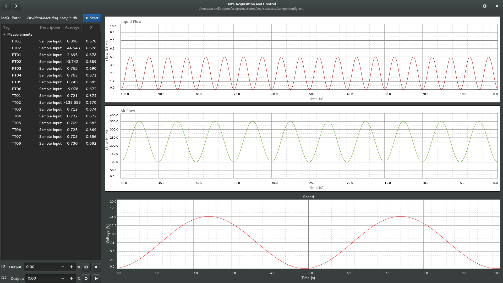

.. _intro:

Introduction
============

Dactl is an application for creating custom data acquisition and control systems
under the GNOME desktop environment. At this time it is heavily dependent on the
existence of a valid configuration, the details of which are entirely undocumented.

There is a companion library that dactl is pretty heavily reliant on and will be
referenced to through the documentation, `libcld <https://github.com/geoffjay/libcld>`_.
It has it's own (incomplete) documentation which can be viewed
`here <https://libcld.readthedocs.org>`_.

This software is still in early stages of development

Sample Layout
-------------

Using `this <https://github.com/coanda/dactl/blob/master/docs/source/assets/sample-config.xml>`_
configuration file dactl will generate the view seen here.

   A sample dactl layout configuration.

Existing Features
-----------------

* XML configurable UI classes for:

  * AI channel
  * AO channel
  * DI channel
  * DO channel
  * Log file (start/stop)
  * Strip chart

* UI for changing the properties of:

  * libcld channel types (AI/AO/DI/DO/Math)
  * libcld data series (incomplete)
  * libcld channel calibrations
  * libcld logs

* A page to export logged database tables as CSV files
* Framework for custom plugins. See the `example plugin. <https://github.com/coanda/dactl-mcc-plugin>`

Planned Features
-----------------------------------

* Configuration-less mode
* DBus API for adding and configuring UI
* XML configurable UI classes for:

  * Recording video from OpenCV compatible cameras
  * Chart for viewing recorded history of measurement data
  * Data browser that connects to stored CSV and SQLite logs

* UI for changing the properties of:

  * General application settings
  * All dactl UI widgets

* Peas plugin loader
* Ability to tweak dactl UI widgets using Gtk properties of underlying classes

Other Things that are Present but Non-functional
------------------------------------------------

* All plugins in src/plugins other than Velmex which is only partially complete
* A page to edit the configuration file using gtksourceview
