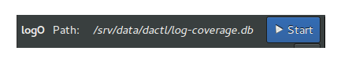

.. _config:

=============
Configuration
=============

Analog Input Control
^^^^^^^^^^^^^^^^^^^^

This section shows how to add ann analog input control to a configuration file.

.. code-block:: xml
   :linenos:

   <ui:object id="ai-ctl0" type="ai" ref="/daqctl0/dev0/ai00"/>

**Table of Configurable Attribute**

+-----------+---------------+
| attribute | default value |
+-----------+---------------+
| id        | null          |
+-----------+---------------+
| ref       | null          |
+-----------+---------------+

This class contains no configurable properties.

The Analog Input Control as it appears when added to the interface:

Analog Output Control
^^^^^^^^^^^^^^^^^^^^^

.. code-block:: xml
   :linenos:

   <ui:object id="ao-ctl0" type="ao" ref="/daqctl0/dev0/ao00"/>

**Table of Configurable Attribute**

+-----------+---------------+
| attribute | default value |
+-----------+---------------+
| id        | null          |
+-----------+---------------+
| ref       | null          |
+-----------+---------------+

This class contains no configurable properties.

Box
^^^

This section shows how to add a box to a configuration file.

.. code-block:: xml
   :linenos:

   <ui:object id="box0" type="box">
     <ui:property name="homogeneous">true</ui:property>
     <ui:property name="orientation">horizontal</ui:property>
     <ui:property name="expand">true</ui:property>
     <ui:property name="fill">true</ui:property>
     <ui:property name="spacing">0</ui:property>
     <ui:property name="margin-top">0</ui:property>
     <ui:property name="margin-right">0</ui:property>
     <ui:property name="margin-bottom">0</ui:property>
     <ui:property name="margin-left">0</ui:property>
     <ui:property name="hexpand">true</ui:property>
     <ui:property name="vexpand">true</ui:property>
     <!--
        - Can contain <ui:object> elements of type:
        -
        -  * "ai":         Dactl.AIControl
        -  * "ao":         Dactl.AOControl
        -  * "box":        Dactl.Box
        -  * "tree":       Dactl.ChannelTreeView
        -  * "chart":      Dactl.Chart
        -  * "stripchart": Dactl.StripChart
        -  * "pnid":       Dactl.Pnid
        -  * "pid":        Dactl.PidControl
        -  * "exec":       Dactl.ExecControl
        -  * "log":        Dactl.LogControl
        -  * "video":      Dactl.VideoProcessor
        -->
   </ui:object>

**Table of Configurable Attribute**

+-----------+---------------+
| attribute | default value |
+-----------+---------------+
| id        | null          |
+-----------+---------------+
| name      | null          |
+-----------+---------------+

**Table of Configurable Property**

+---------------+-----------+---------------+
| property      | data type | default value |
+---------------+-----------+---------------+
| homogeneous   | bool      | null          |
+---------------+-----------+---------------+
| orientation   | string    | null          |
+---------------+-----------+---------------+
| expand        | bool      | null          |
+---------------+-----------+---------------+
| fill          | bool      | null          |
+---------------+-----------+---------------+
| spacing       | int       | null          |
+---------------+-----------+---------------+
| margin-top    | int       | null          |
+---------------+-----------+---------------+
| margin-right  | int       | null          |
+---------------+-----------+---------------+
| margin-bottom | int       | null          |
+---------------+-----------+---------------+
| margin-left   | int       | null          |
+---------------+-----------+---------------+
| hexpand       | bool      | null          |
+---------------+-----------+---------------+
| vexpand       | bool      | null          |
+---------------+-----------+---------------+

Channel Treeview
^^^^^^^^^^^^^^^^

This section shows how to add a channel treeview to a configuration file.

.. code-block:: xml
   :linenos:

   <ui:object id="tree0" type="tree">
     <ui:property name="width-request">width-re</ui:property>
     <ui:property name="show-header">true</ui:property>
     <ui:property name="expand">true</ui:property>
     <ui:property name="fill">true</ui:property>
     <ui:property name="show-tag">true</ui:property>
     <ui:property name="show-desc">true</ui:property>
     <ui:property name="show-sample-sdev">true</ui:property>
     <ui:property name="show-sample-size">true</ui:property>
     <ui:property name="show-units">true</ui:property>
     <!--
        - Can contain <ui:object> elements of type:
        -
        -  * "tree-category": Dactl.ChannelTreeCategory
        -  * "tree-entry":    Dactl.ChannelTreeEntry
        -->
   </ui:object>

**Table of Configurable Attribute**

+-----------+---------------+
| attribute | default value |
+-----------+---------------+
| id        | null          |
+-----------+---------------+
| chref     | null          |
+-----------+---------------+

**Table of Configurable Property**

+------------------+-----------+---------------+
| property         | data type | default value |
+------------------+-----------+---------------+
| width-request    | int       | null          |
+------------------+-----------+---------------+
| show-header      | bool      | null          |
+------------------+-----------+---------------+
| expand           | bool      | null          |
+------------------+-----------+---------------+
| fill             | bool      | null          |
+------------------+-----------+---------------+
| show-tag         | bool      | null          |
+------------------+-----------+---------------+
| show-desc        | bool      | null          |
+------------------+-----------+---------------+
| show-sample-sdev | bool      | null          |
+------------------+-----------+---------------+
| show-sample-size | bool      | null          |
+------------------+-----------+---------------+
| show-units       | bool      | null          |
+------------------+-----------+---------------+

The Channel Treeview Control as it appears when added to the interface:

.. figure:: assets/channel-treeview.png

Channel Tree Entry
^^^^^^^^^^^^^^^^^^

This section shows how to add a channel tree entry to a configuration file.

.. code-block:: xml
   :linenos:

   <ui:object id="entry0" type="tree-entry" chref="/daqctl0/dev0/ai00"/>

**Table of Configurable Attribute**

+-----------+---------------+
| attribute | default value |
+-----------+---------------+
| id        | null          |
+-----------+---------------+
| chref     | null          |
+-----------+---------------+

Channel Tree Category
^^^^^^^^^^^^^^^^^^^^^

This section shows how to add a channel tree category to a configuration file.

.. code-block:: xml
   :linenos:

   <ui:object id="cat0" type="tree-category"/>
     <ui:property name="title">Title</ui:property>
     <!--
        - Can contain <ui:object> elements of type:
        -
        -  * "tree-category": Dactl.ChannelTreeCategory
        -  * "tree-entry":    Dactl.ChannelTreeEntry
        -->
   </ui:object>

**Table of Configurable Attribute**

+-----------+---------------+
| attribute | default value |
+-----------+---------------+
| id        | null          |
+-----------+---------------+

**Table of Configurable Property**

+------------------+-----------+---------------+
| property         | data type | default value |
+------------------+-----------+---------------+
| title            | string    | null          |
+------------------+-----------+---------------+

Command Execution Control
^^^^^^^^^^^^^^^^^^^^^^^^^

This section shows how to add a control that executes the given command to a configuration file.

.. code-block:: xml
   :linenos:

   <ui:object id="exec-ctl0" type="exec"/>

**Table of Configurable Attribute**

+-----------+---------------+
| attribute | default value |
+-----------+---------------+
| id        | null          |
+-----------+---------------+

This class contains no configurable properties.

Log Control
^^^^^^^^^^^

This section shows how to add a log control to a configuration file.

.. code-block:: xml
   :linenos:

   <ui:object id="log-ctl0" type="log" ref="/logctl0/log0"/>

**Table of Configurable Attribute**

+-----------+---------------+
| attribute | default value |
+-----------+---------------+
| id        | null          |
+-----------+---------------+
| ref       | null          |
+-----------+---------------+

This class contains no configurable properties.

The Log Control as it appears when added to the interface:

Page
^^^^

This section shows how to add a page to a configuration file.

.. code-block:: xml
   :linenos:

   <ui:object id="pg0" type="page">
     <ui:property name="index">0</ui:property>
     <ui:property name="title">Title</ui:property>
     <ui:property name="expand">true</ui:property>
     <ui:property name="fill">true</ui:property>
     <ui:property name="visible">true</ui:property>
     <!--
        - Can contain <ui:object> elements of type:
        -
        -  * "box":  Dactl.Box
        -->
   </ui:object>

**Table of Configurable Attribute**

+-----------+---------------+
| attribute | default value |
+-----------+---------------+
| id        | null          |
+-----------+---------------+

**Table of Configurable Property**

+-------------------+---------------------+---------------+
| property          | data type           | default value |
+-------------------+---------------------+---------------+
| index             | int                 | null          |
+-------------------+---------------------+---------------+
| title             | string              | null          |
+-------------------+---------------------+---------------+
| expand            | bool                | null          |
+-------------------+---------------------+---------------+
| fill              | bool                | null          |
+-------------------+---------------------+---------------+
| visible           | bool                | null          |
+-------------------+---------------------+---------------+

PID Control
^^^^^^^^^^^

This section shows how to add a pid control to a configurtion file.

.. code-block:: xml
   :linenos:

   <ui:object id="pid-ctl0" type="pid" ref="/atmctl0/pid0"/>

**Table of Configurable Attribute**

+-----------+---------------+
| attribute | default value |
+-----------+---------------+
| id        | null          |
+-----------+---------------+
| ref       | null          |
+-----------+---------------+

This class contains no configurable properties.

The PID Control as it appears when added to the interface:

.. figure:: assets/pid-control.png

Plugin Control
^^^^^^^^^^^^^^

This section shows how to add a plugin control to a configuration file.

.. code-block:: xml
   :linenos:

   <ui:object id="plugin-ctl0" type="plugin-control" parent="box0">
     <!-- Can contain references to the CLD tree, eg. -->
     <ui:property name="ref">/daqctl/dev0/ao00</ui:property>
   </ui:object>

**Table of Configurable Attribute**

+-----------+---------------+
| attribute | default value |
+-----------+---------------+
| null      | null          |
+-----------+---------------+

**Table of Configurable Property**

+-------------------+---------------------+---------------+
| property          | data type           | default value |
+-------------------+---------------------+---------------+
| ref               | string              | null          |
+-------------------+---------------------+---------------+

PNID Control
^^^^^^^^^^^^

This section shows how to add a pnid to a configuration file.

.. code-block:: xml
   :linenos:

   <ui:object id="pnid0" type="pnid">
     <ui:property name="image-file">image-file.svg</ui:property>
     <ui:property name="expand">true</ui:property>
     <ui:property name="fill">true</ui:property>
     <ui:property name="timeout">1000</ui:property>
     <!--
        - Can contain <ui:object> elements of type:
        -
        -  * "pnid-text": Dactl.PnidElement
        -->
   </ui:object>

**Table of Configurable Attribute**

+-----------+---------------+
| attribute | default value |
+-----------+---------------+
| id        | null          |
+-----------+---------------+

**Table of Configurable Property**

+-------------------+---------------------+---------------+
| property          | data type           | default value |
+-------------------+---------------------+---------------+
| image-file        | string              | null          |
+-------------------+---------------------+---------------+
| expand            | bool                | null          |
+-------------------+---------------------+---------------+
| fill              | bool                | null          |
+-------------------+---------------------+---------------+
| timeout           | int                 | null          |
+-------------------+---------------------+---------------+

PnidElement
^^^^^^^^^^^

This section shows how to add a PNID to a configuration file.

.. code-block:: xml
   :linenos:

   <ui:object id="element0" type="element">
     <ui:property name="cld-ref">cld-ref</ui:property>
     <ui:property name="svg-ref">svg-ref</ui:property>
   </ui:object>

**Table of Configurable Attribute**

+-----------+---------------+
| attribute | default value |
+-----------+---------------+
| id        | null          |
+-----------+---------------+
| cld-ref   | null          |
+-----------+---------------+
| svg-ref   | null          |
+-----------+---------------+

**Table of Configurable Property**

+-------------------+---------------------+---------------+
| property          | data type           | default value |
+-------------------+---------------------+---------------+
| cld-ref           | string              | null          |
+-------------------+---------------------+---------------+
| svg-ref           | string              | null          |
+-------------------+---------------------+---------------+

Chart
^^^^^

This secion shows how to add a chart to a configuration file.

.. code-block:: xml
   :linenos:

   <ui:object id="chart0" type="chart">
     <ui:property name="title">Title</ui:property>
     <ui:property name="expand">true</ui:property>
     <ui:property name="fill">true</ui:property>
     <ui:property name="height-min">0</ui:property>
     <ui:property name="weight-min">0</ui:property>
     <ui:property name="show-title">true</ui:property>
     <ui:property name="show-grid">true</ui:property>
     <ui:property name="show-grid-border">true</ui:property>
     <!--
        - Can contain <ui:object> elements of type:
        -
        -  * "chart-axis": Dactl.Axis
        -->
   </ui:object>

**Table of Configurable Attribute**

+-----------+---------------+
| attribute | default value |
+-----------+---------------+
| id        | null          |
+-----------+---------------+

**Table of Configurable Property**

+-------------------+---------------------+---------------+
| property          | data type           | default value |
+-------------------+---------------------+---------------+
| title             | string              | null          |
+-------------------+---------------------+---------------+
| expand            | bool                | null          |
+-------------------+---------------------+---------------+
| fill              | bool                | null          |
+-------------------+---------------------+---------------+
| height-min        | int                 | null          |
+-------------------+---------------------+---------------+
| width-min         | int                 | null          |
+-------------------+---------------------+---------------+
| show-title        | bool                | null          |
+-------------------+---------------------+---------------+
| show-grid         | bool                | null          |
+-------------------+---------------------+---------------+
| show-grid-border  | bool                | null          |
+-------------------+---------------------+---------------+

Chart Axis
^^^^^^^^^^

This section shows how to add a chart axis to a configuration file.

.. code-block:: xml
   :linenos:

   <ui:object id="ax0" type="chart-axis">
     <ui:property name="label">true</ui:property>
     <ui:property name="orientation">horizontal</ui:property>
     <ui:property name="min">true</ui:property>
     <ui:property name="max">true</ui:property>
     <ui:property name="div-major">0</ui:property>
     <ui:property name="div-minor">0</ui:property>
     <ui:property name="show-labe">true</ui:property>
     <ui:property name="show-minor-ticks">true</ui:property>
     <ui:property name="show-major-ticks">true</ui:property>
     <ui:property name="show-minor-labels">true</ui:property>
     <ui:property name="show-major-labels">true</ui:property>
     <ui:property name="show-start-label">true</ui:property>
     <ui:property name="show-end-label">true</ui:property>
     <ui:property name="rotate-label">true</ui:property>
   </ui:object>

**Table of Configurable Attribute**

+-----------+---------------+
| attribute | default value |
+-----------+---------------+
| id        | null          |
+-----------+---------------+

**Table of Configurable Property**

+-------------------+-----------+---------------+
| property          | data type | default value |
+-------------------+-----------+---------------+
| label             | bool      | null          |
+-------------------+-----------+---------------+
| orientation       | string    | null          |
+-------------------+-----------+---------------+
| min               | bool      | null          |
+-------------------+-----------+---------------+
| max               | bool      | null          |
+-------------------+-----------+---------------+
| div-major         | int       | null          |
+-------------------+-----------+---------------+
| div-minor         | int       | null          |
+-------------------+-----------+---------------+
| show-labe         | bool      | null          |
+-------------------+-----------+---------------+
| show-minor-ticks  | bool      | null          |
+-------------------+-----------+---------------+
| show-major-ticks  | bool      | null          |
+-------------------+-----------+---------------+
| show-minor-labels | bool      | null          |
+-------------------+-----------+---------------+
| show-major-labels | bool      | null          |
+-------------------+-----------+---------------+
| show-start-label  | bool      | null          |
+-------------------+-----------+---------------+
| show-end-label    | bool      | null          |
+-------------------+-----------+---------------+
| rotate-label      | bool      | null          |
+-------------------+-----------+---------------+

Chart Trace
^^^^^^^^^^^

This secion shows how to add a chart trace to a configuration file.

.. code-block:: xml
   :linenos:

   <ui:object id="tr0" type="chart-trace" ref="/daqctl0/dev0/ai00">
     <ui:property name="buffer-size">0</ui:property>
     <ui:property name="draw-type">null</ui:property>
     <ui:property name="line-weight">0.0</ui:property>
     <ui:property name="color">0</ui:property>
     <ui:property name="stride">0</ui:property>
     <ui:property name="window-size">0</ui:property>
     <ui:property name="show-major-labels">true</ui:property>
   </ui:object>

**Table of Configurable Attribute**

+-----------+---------------+
| attribute | default value |
+-----------+---------------+
| id        | null          |
+-----------+---------------+
| ref       | null          |
+-----------+---------------+

**Table of Configurable Property**

+-------------------+---------------------+---------------+
| property          | data type           | default value |
+-------------------+---------------------+---------------+
| buffer-size       | int                 | null          |
+-------------------+---------------------+---------------+
| draw-type         | Dactl.TraceDrawType | null          |
+-------------------+---------------------+---------------+
| line-weight       | double              | null          |
+-------------------+---------------------+---------------+
| color             | int                 | null          |
+-------------------+---------------------+---------------+
| stride            | int                 | null          |
+-------------------+---------------------+---------------+
| window-size       | int                 | null          |
+-------------------+---------------------+---------------+
| duration          | string              | null          |
+-------------------+---------------------+---------------+

Stripchart
^^^^^^^^^^

This section shows how to add a stripchart to a configuration file.

.. code-block:: xml
   :linenos:

   <ui:object id="chart0" type="stripchart">
     <ui:property name="title">Title</ui:property>
     <ui:property name="expand">true</ui:property>
     <ui:property name="fill">true</ui:property>
     <ui:property name="height-min">0</ui:property>
     <ui:property name="width-min">0</ui:property>
     <ui:property name="show-title">true</ui:property>
     <ui:property name="show-grid">true</ui:property>
     <ui:property name="show-grid-border">true</ui:property>
     <ui:property name="points-per-second">0</ui:property>
     <!--
        - Can contain <ui:object> elements of type:
        -
        -  * "chart-axis":  Dactl.Axis
        -  * "chart-trace": Dactl.Trace
        -->
   </ui:object>

**Table of Configurable Attribute**

+-----------+---------------+
| attribute | default value |
+-----------+---------------+
| id        | null          |
+-----------+---------------+

**Table of Configurable Property**

+-------------------+---------------------+---------------+
| property          | data type           | default value |
+-------------------+---------------------+---------------+
| title             | string              | null          |
+-------------------+---------------------+---------------+
| expand            | bool                | null          |
+-------------------+---------------------+---------------+
| fill              | bool                | null          |
+-------------------+---------------------+---------------+
| height-min        | int                 | null          |
+-------------------+---------------------+---------------+
| width-min         | int                 | null          |
+-------------------+---------------------+---------------+
| show-title        | bool                | null          |
+-------------------+---------------------+---------------+
| show-grid         | bool                | null          |
+-------------------+---------------------+---------------+
| show-grid-border  | bool                | null          |
+-------------------+---------------------+---------------+
| points-per-second | int                 | null          |
+-------------------+---------------------+---------------+

The Stripchart as it appears when added to the interface:

Double clicking the chart reveals basic configuraton options:

.. figure:: assets/striphart-settings.png
